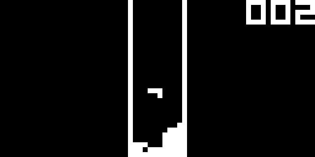

# Cheight
Simple CHIP-8 interpreter written in C and using SDL3 for rendering.
## Dependencies
- SDL3
## Building
```$ make```
## Usage
```$ cheight FILENAME```
## Roadmap
- [ ] Implement getopts or something similar
- [ ] Implement SUPER-CHIP
- [ ] Implement XO-CHIP
## Screenshots



## Controls
Original CHIP-8 interpreters used following keypad:
| 1 | 2 | 3 | C |
| - | - | - | - |
| 4 | 5 | 6 | D |
| 7 | 8 | 9 | E |
| A | 0 | B | F |

On modern systems use the left side of QWERTY keyboard like so:
| 1 | 2 | 3 | 4 |
| - | - | - | - |
| Q | W | E | R |
| A | S | D | F |
| Z | X | C | V |
